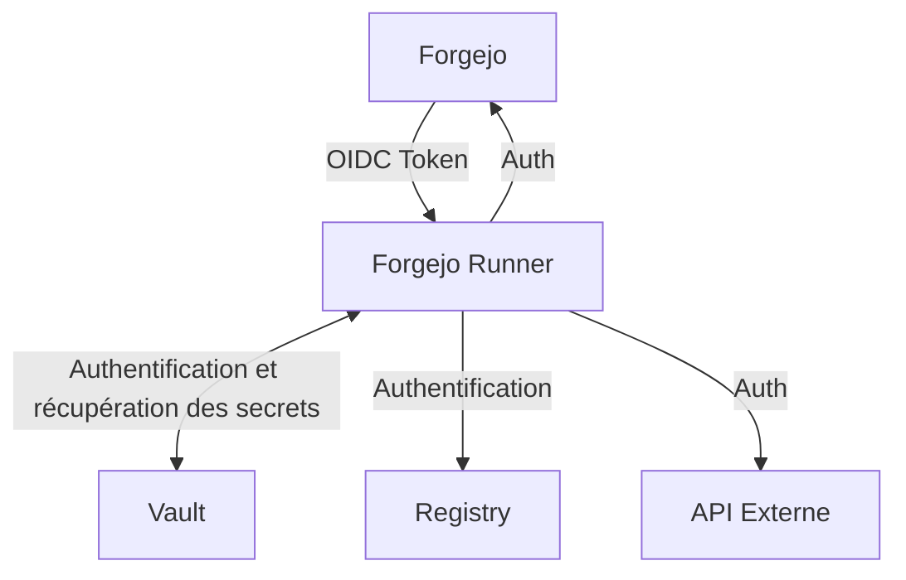

# Server git ?

Avant toute choses, je n'ai pas choisis Gitlab étant donné que je le trouve trop lourd pour ce que je veux et vais faire. Par le passé j'ai utilisé Gitea, mais par envie de changement et de découverte j'ai décidé de migrer vers Forgejo, qui est un fork de Gitea, mais avec une vraie communauté.

## Rebranding ?!

Et oui, a travers Weebo5 je vais essayer de faire un maximum de rebranding possible, et cela affin d'inclure mon logo un peu partout. Oui je peux encore mettre mes chaussures :P.

[Customizing forgejo](https://forgejo.org/docs/next/contributor/customization/)

## CI ! CD ?

J'ai actuellement 2 CI en vision, l'historique qui est Tekton et la nouvelle qui est Forgejo Action. Je vais essayer de découvrir un maximum la seconde mais je garde Tekton sous le coude en cas de besoin, et surtout pour faire le parallèle entre les deux, et ainsi faire un comparatif.

Pour l'usage que je souhaite en faire, je pense uttilisé la solution en cours de développement basé sur les repos suivant:

- [Forgejo runner but with kube](https://github.com/eleboucher/runner)
- [Hardened Kubernetes runner](https://codeberg.org/ppaslan/forgejo-kubernetes-runners)

### Build docker

L'objectif est de faire mes premiers pas avec l'user-namespace dans kube et de commencer a faire du build via Buildah.

## Workflow

Il y a beaucoup de sujet important a prendre en compte afin de ce prémunir de potentielle problème et/ou potentielle incident.

Il devient nécessaire de scinder les ressources nécessaire au bon fonctionnement d'une pipeline:

- Secret pour les credentials
  - Authentification au registry
  - Authentification au forgejo
  - Token X ou Y pour des api externets (Github Release, Site X ou Y, Notification, etc...)
  - Token de repo (Permet de patch un repo gitops, ou de faire du push sur un repo, etc...)
  - Token de service (Permet par exemple de forcer un rollout ArgoCD, ou de faire du patch sur un service, etc...)
- Variable d'environnement (non sensible)
  - Nom de l'environnement (dev, staging, prod)
  - Nom du projet
  - Nom des artefacts
  - Configuration de l'application (ex: nombre de réplica, ressources, etc...)
  - Configuration de la pipeline (ex: nombre de job, etc...)
- Code de la pipeline (Inclus dans le repo)
- Etc...

### Authentification

Certains secret sont nécessaire pour le bon fonctionnement de la pipeline comme l'authentification au registry. Cette authentification ce faisant a l'aide d'un token pouvant rotate automatiquement ne doit pas être stocké dans Forgejo, mais par simplicité et automatisation, le sera dans un vault. Mais ce token devra etre accessible par la pipeline. Ceci est atteignable via une authentification via [Forgejo oidc token](https://forgejo.org/docs/next/user/actions/security-openid-connect/).

Tout comme les credentials d'authentification au registry, les token X ou Y pour des api externes ou de service devront être stocké dans un vault et accessible via l'oidc token de forgejo si autorisé. Sans oublier que si délégation possible, celle-ci sera préférée a l'utilisation d'un token stocké dans le vault, afin de limiter les risques en cas de compromission du runner ou d'une fuite de ce token.

Sans oublier que le jeton oidc fournis par Forgejo au runner est invalidé a la fin de la pipeline, ce qui permet de limiter les risques en cas de compromission du runner ou d'une fuite de ce jeton.

#### Vault

Github fournis [une page de documentation](https://github.com/hashicorp/vault-action) bien plus complète que celle de Forgejo, mais le principe reste le même, et les risques aussi.

Pour la configuration de Vault, [la partit terraform est accessible ici](https://registry.terraform.io/providers/hashicorp/vault/latest/docs/resources/jwt_auth_backend_role).

#### Kubernetes

Comme vault, Kubernetes fournis un moyen de validé l'authentification OIDC, [Un super article de blog en parle plus en détail](https://une-tasse-de.cafe/blog/apiserver-multi-idp/). Mais, je vais tenter de faire une double validation de ce systéme:

- Validation du jeton via l'api server Kubernetes
- Validation et restriction des ressources via [ProxyAuthK8s](https://github.com/batleforc/ProxyAuthK8S)

#### ArgoCD

Tien tien tien... notre troisiéme service permettrait lui aussi de valider le jeton OIDC de l'action Forgejo ? Et oui, c'est possible vue qu'ArgoCD inclus un serveur DEX, pour plus d'info [cette page de documentation](https://argo-cd.readthedocs.io/en/latest/operator-manual/user-management/github-actions/) explique comment faire. (Ne partez pas, je vais rentrer dans les détails de ce setup l'article dédié a ArgoCD).
